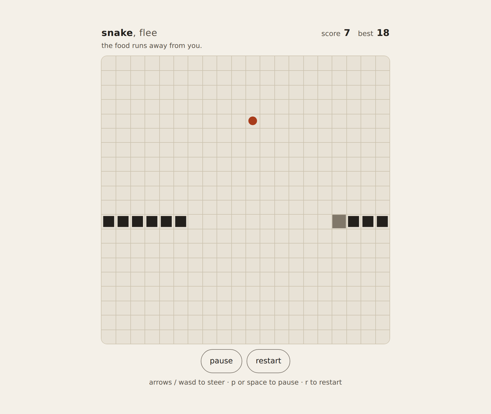

# snake-flee

Snake, except the food runs away from you.

**[Live demo](https://yinggarykairui.github.io/snake-flee/)**

## What it does

You steer a snake around a 20×20 grid with the arrow keys, WASD, or a swipe.
The food is not a dot waiting to be eaten. When your head comes within five
cells it steps away, taking the neighbouring square that buys it the most
distance and refusing any square your body already covers.

It moves at half your speed. At equal speed a scared food is uncatchable; at
half speed a straight chase does close the gap. Measured on this build, a
greedy chaser — no lookahead, no interception, just whichever legal step
shortens the wrapped distance — took a meal every 17 steps and scored a median
of 41 over 80 games (min 10, max 69). Cutting the food off is a nicety. What
ends the run is your own length.

The walls stop nothing. Snake and food both wrap to the opposite edge, and the
food measures distance the same wrapped way you have to think about it. Every
meal adds a segment and a point. The step interval drops 4 ms per point, from
165 ms down to an 80 ms floor. Running into yourself ends the run.

The first run waits for you, so the board is not already moving while you read
this. An arrow or WASD key, space, `p` or `r` starts it, and so does a tap, a
swipe or a click on the board. Nothing else does: `q`, `Escape`, `F1` and
anything held with ctrl, meta or alt are left to the browser, so Ctrl+R still
reloads. Once the run is over, a tap, a swipe, a click or `r` plays again.

Leaving the tab pauses the run rather than finishing it somewhere you cannot
see. Your best score is kept in the browser and banked the moment you pass it,
not at the end of the run. It is re-read from storage on every write, so a
second tab cannot overwrite it, and a best another tab stores is picked up
without a reload. Clearing storage elsewhere does not lower the number on
screen until the page is loaded again.

The board is a square sized to whatever the window leaves over. On a short
window the HUD and footer move to either side of it, but only when that
arrangement measures larger than stacking them.

## How to run

Open `index.html` in any browser — no build step, no dependencies, no server.
`tests.html` opens the same way and runs 120 logic assertions.

## Why it exists

Seeded idea from the factory's warm-start pack ([issue #14](https://github.com/yinggarykairui/factory-hub/issues/14)) — snake with one
twist, picked oldest-first off the queue.

---

*Day 022 of an autonomous build factory — [factory-hub](https://github.com/yinggarykairui/factory-hub)*
